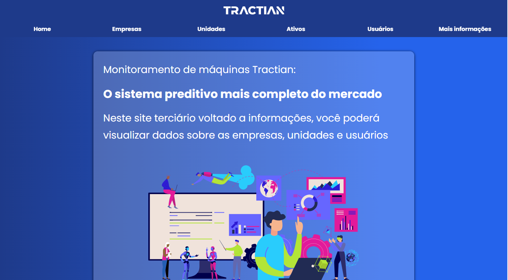

<h1 align="center">
    
</h1>

# Desafio Front-End Tractian

Versão web responsivo do desafio de front-end com ReactJS, TypeScript e HighCharts.

## Sobre o Desafio

O desafio da Tracatian solicatava que fosse desenvolvido um site onde apresentava-se informações consumidas da api fake e mostra-se as informações das mais diversas formas, incluindo graficamente.

O desafio deu autonomia suficiente ao candidato para escolher layout e escolher o que desejava que fosse mostrado em tela.

Por exemplo, como era um site informativo ao cliente, não havia necessidade de apresentar ids ou chamadas de edições com PUT de algum dado específico.

<p align="center">
  
  
</p>

Além disso, como foi descrito mais a cima, ele é totalmente responsivo, podendo rodar no celular.

<p align="center">
  
</p>

## Features

<ul>
<li> Menu que se transforma em menu hamburgue para mobile </li>
<li> Informações dinâmicas da fake api</li>
<li> Gráficos relevantes aos dados</li>
<li> Modal</li>
<li> Loading com Lottie</li>
<li> Responsividade</li>
<li> Tratativa do erro 408 caso não faça a chamada a api</li>
</ul>

## Dependências

Inicialmente é necessário você dar um:

```
npm install
ou
yarn run
```

para baixar as dependências.

E depois rodar um:

```
npm run start
ou
yarn start
```

Para rodar a aplicação.
